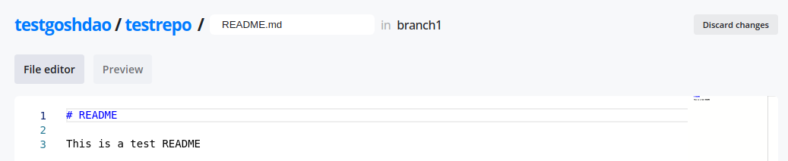
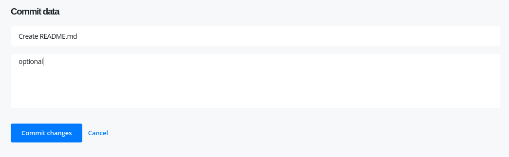
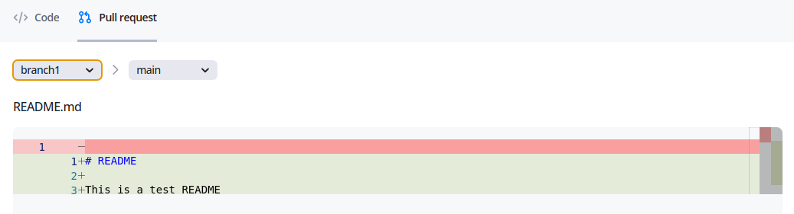
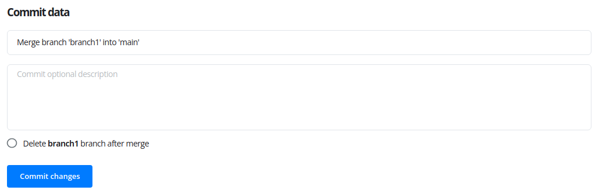
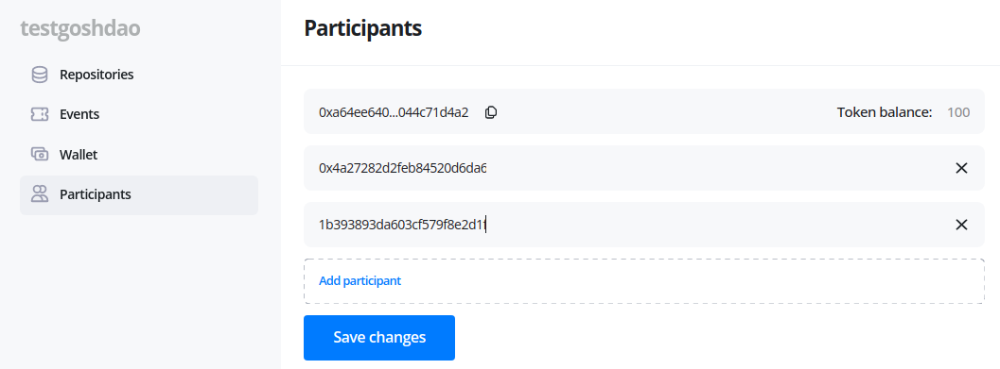
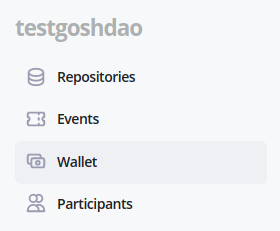
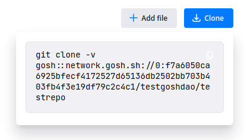

# Docker Extension

GOSH Docker Extension is a good way to get started with GOSH.&#x20;

It implements GOSH repository management and image verification as the newest feature of Docker - a Docker Extension.

You will be able to create your GOSH account and Decentralized Autonomous Organization (DAO), set up and manage repositories through a graphical interface directly in Docker Desktop. Repositories stored in GOSH can then be interacted with like any regular remote repository, with a few small configurations to git, making decentralized code management easily available to anyone.

Images built directly from code stored in GOSH can be verified as GOSH-sourced in the Docker Extension, ensuring security of the software supply chain. You will always know what code specifically is running in your containers, and that none of it was tampered with during build.

## Installation

Get the latest [Docker Desktop](https://www.docker.com/products/docker-desktop/) (4.8.0 or later), which supports extensions.

Launch the Desktop, go to the **Extensions** section, and click Add Extensions.

<figure><figcaption></figcaption></figure>

Select and install **Gosh** extension on the marketplace.

## Create account

To get started with GOSH, you need an active Github-account

Open **Gosh verified images** extension in Docker Desktop and click **Create account with Github.**

<figure><figcaption></figcaption></figure>

Enter the username.

!!! note
    The User name must contain only Latin letters, numbers, hyphen, underscore character *( a...z, 0...9, -, _ )*

GOSH will generate a seed phrase for you.&#x20;

<figure><figcaption></figcaption></figure>

If you are familiar with blockchain, you know what to do with a seed phrase.&#x20;

If you're new to blockchain, all you need to know, is that this is the key to your account and all your assets on GOSH. Your public key, which can identify you on the blockchain and the secret key you'll use to sign your actions can always be calculated from your seed phrase.&#x20;

!!! info
    **Write your seed phrase down and store it somewhere safe, and never share it with anyone. Avoid storing it in plain text or screenshots, or any other non-secure way. If you lose it, you lose access to your assets. Anyone who gets it, gets full access to your assets.**

**Your username and seed phrase will be used to log into GOSH.**

Once you have written down your seed phrase, click **Create account**.

GOSH will ask you to set up a PIN code:&#x20;

<figure><figcaption></figcaption></figure>

Once done, you will be logged into GOSH.

## Create Organization

The Organizations page will open after your account is created. At first there will be no Organizations or Repositories there.

<figure><figcaption></figcaption></figure>

Click **New organization** button in the Organizations section.

Input Organization name.

!!! warning
    The Organizations name must contain only Latin letters, numbers, hyphen, underscore character `( a...z, 0...9, -, _ )`

The first mandatory member is the creator, identified by their username. Any other members can be added at creation or later - just enter the username of each member with the `@` symbol.

<figure><figcaption></figcaption></figure>

Click **Create organization**.

Once created, your organization will appear in the organization list. Click on it to continue.

<figure><figcaption></figcaption></figure>

## ​Create Repository

To create a repository in your organization click **Create** in the Repositories section.

<figure><figcaption></figcaption></figure>

Enter repository name and click **Create repository**.

!!! warning
    The repository name must contain only Latin letters, numbers, hyphen, underscore character `( a...z, 0...9, -, _ )`

<figure><figcaption></figcaption></figure>

## Create Branch

Repository is created with default main branch. To create another branch, click on the **branches** counter.

<figure><figcaption></figcaption></figure>

Select the branch to be forked, enter new branch name, and click​ **Create branch**.

!!! warning
    The branch name must contain only Latin letters, numbers, hyphen, underscore character `( a...z, 0...9, -, _ )`

<figure><figcaption></figcaption></figure>

Once the branch is created, it will appear in the branches list.

<figure><figcaption></figcaption></figure>

Switch to it via drop down list.

<figure><figcaption></figcaption></figure>

## Create File

To create file, click **Add file** button.

Enter file contents and name. MD syntax is supported for preview.

Once done, scroll down to **Commit data**, enter commit info and click **Commit changes**.

If the branch you are working in requires no vote to commit to, the changes will be commited immediately/ Otherwise a DAO [vote](docker-extension.md#voting-in-smv-soft-majority-vote) will be initiated.

## Create Pull Request

Click on the **Pull requests** tab and set up the pull request: what branch to merge from and to.&#x20;

View the diff, scroll down to **Commit data**, enter details and click **Commit changes**.

!!! info
    When merging into the main branch, and in some other cases (depending on DAO setup), a DAO proposal will be initiated by trying to commit.

    [Organization Tokens have to be sent to the DAO Soft Majority Vote](docker-extension.md#move-tokens-to-smv) contract to start a proposal for DAO members to [vote](docker-extension.md#voting-in-smv-soft-majority-vote) on.

## Voting in SMV (Soft Majority Vote)

Actions that require a DAO vote, such as merging into main, are performed by creating a proposal.

To create a proposal, or to vote for a proposal someone else created, some of your tokens need to be [allocated to SMV](docker-extension.md#move-tokens-to-smv) (once the proposal is completed), you can get them back.

For example, to merge into main, [create a pull request](docker-extension.md#create-pull-request) from some other branch. A proposal will be generated and will appear on the **Events** page.

<figure><figcaption></figcaption></figure>

The voting period is indicated on the proposal page. This is the time allotted for [voting](../on-chain-architecture/organizations-gosh-dao-and-smv.md#soft-majority-voting). Unless a decisive majority of >50% is achieved early, votes will be counted at the end of this period.

The thumbs up and down counters under **Running** status indicate how many tokens were used by now to vote for and against the proposal.

The green indicator in the top right corner means that the SMV smart contracts are not currently processing any new votes. It turns red when the SMV contracts are busy.

Once you have made a decision, vote for the proposal with your tokens. Vote registration can take a bit of time.&#x20;

!!! info
    As per the rules of Soft Majority Voting, to have a proposal approved early, you need at least 50% of the total supply of tokens in the repository + 1 token used to vote for the proposal.

    For example, in a repository with two members, where the total supply of tokens is 200, 101 token needs to be used to instantly approve a proposal. Thus with every member holding 100 tokens a proposal can never be instantly completed without the participation of members other than the proposal's author.

    On the other hand, so as not to depend on all members of an organization to vote, soft majority vote will complete with an approval at the end of the voting period, if 10% of the total token supply were used to vote for, and no one voted against.

    The more tokens are sent against the proposal, the higher the approving amount needs to be (up to 50% of the total supply  + 1 token) for the proposal to pass.

Other members of the Organization, who have transferred their tokens to SMV, will be able to vote for the proposal on this page in their own accounts.

!!! info
    Currently, even in organizations with a single member, voting still takes place when a proposal is created. 51 tokens are needed to approve a proposal in such a repository.

Once a majority has been reached early, or the voting period ended and the soft majority vote result was decided, the proposal completes and the proposed action is performed.

## View Public Key

A user needs to know their public key, for example, when joining an organization.

To view your public key go to the main page of your account and click **Settings**.

<figure><figcaption></figcaption></figure>

## Add Members to Organization 

Go to **Organization** **menu - Participants.** To add participants, click **Add participant** button, enter new participant [public key](docker-extension.md#view-public-key) and click **Save changes**.

## What's next?

Set up [Git remote helper](git-remote-helper.md) and continue working with your repository.

You'll need your wallet credentials. Go to **Organization menu - Wallet** .

Scroll down and copy your Git Remote credentials:

.png)

To view the command to clone your repo, click the **Clone** button on your repo page.

