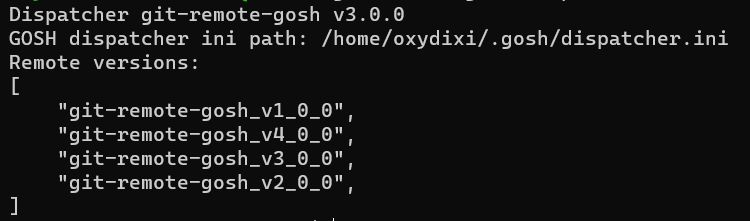
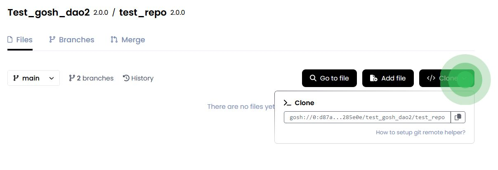

# __Git Remote Helper__

Git Remote Helper (this is a standard mechanism for working with non-standard code storages) is a [`git-client helper`](https://git-scm.com/docs/gitremote-helpers#_description) to interact with remote repositories hosted on the GOSH blockchain. 


## __Installation__


### __Install helper using the installation script__

If you have macOS or Linux, you can use this installation method.

```
wget -O - https://raw.githubusercontent.com/gosh-sh/gosh/dev/install.sh | bash -s
```

If you have Windows, you can use the installation methods below.

[Checking](git-remote-helper.md#verifying-the-installation-resulte) the installation results.


### __Install helper from binary releases__


1. Follow the [`link`](https://github.com/gosh-sh/gosh/releases)
and download the version of the Git Remote Helper for the required operating system (macOS, Linux, Windows).

2. Extract files from tar-file

    (e.g. for Linux x64):

    ```
    tar xvf git-remote-gosh-linux-amd64.tar
    ```

3. Move binary files to any searchable path

    (e.g. /usr/local/bin):

      ```
      mv git-remote-gosh /usr/local/bin
      ```

      ```
      mv git-remote-gosh_v?_0_0 /usr/local/bin
      ```

    and move dispatcher.ini to ~/.gosh/ folder:

    ```
    mkdir ~/.gosh || mv dispatcher.ini ~/.gosh/
    ```

[Checking](git-remote-helper.md#verifying-the-installation-resulte) the installation results.


### __Install helper from source__


1. Prerequisites:

      - Rust v1.66+
      - Protobuf Compiler
      - `git`
      - `make`
      - `gcc`
      - `openssl`

        !!! note
            For Windows users:
            
            make sure that the appropriate [Perl version](https://github.com/openssl/openssl/blob/master/NOTES-PERL.md#perl-on-windows) is installed for your build environment.

2. Clone [`gosh`](https://github.com/gosh-sh/gosh) repository.

3. Go to the `gosh` directory

    ```
      cd gosh
    ```

    Then build all the necessary components:

    ```
      cd v1_x/git-remote-gosh && make install
    ```

    ```
      cd v2_x/git-remote-gosh && make install
    ```

    ```
      cd v3_x/git-remote-gosh && make install
    ```

    ```
      cd v4_x/git-remote-gosh && make install
    ```

    ```
      cd gosh-dispatcher && make install
    ```

    !!! info
        After building all the components, the finished binary files will be located in the `~/.cargo/bin` directory.


      You need to create a configuration file for the Git Remote Helper: `~/.gosh/dispatcher.ini`

      with the following content:


      ```
        git-remote-gosh_v1_0_0
      ```

      ```
        git-remote-gosh_v2_0_0
      ```

      ```
        git-remote-gosh_v3_0_0
      ```

      ```
        git-remote-gosh_v4_0_0
      ```


### __Verifying the installation resulte__


You can check the correctness of the configuration file by running the command:

```
git-remote-gosh dispatcher_ini
```

As a result, you will see the following:




Run the following command to make sure it's available:

```
which git-remote-gosh
```

If the Git Remote Helper is not available, then add path with `git-remote-gosh`
    
for availability via `$PATH`:

```
export PATH="~/.cargo/bin:$PATH"
```


## __Setup user account__


When creating your account in [GOSH Web](gosh-web.md) or [Docker extension](docker-extension.md) you received a GOSH wallet address and keys.

To be able to push to Gosh repositories, you need to set up these credentials for Git Remote Helper.

The Git Remote Helper expects that the wallet credentials are in the file `~/.gosh/config.json` or in the file specified in the environment variable `GOSH_CONFIG_PATH`,

for example:

```
{
  "primary-network": "mainnet",
  "networks": {
    "mainnet": {
      "user-wallet": {
        "profile": "USERNAME",
        "pubkey": "655b120c996b4f69c686cb3b769fbdfa0141006ce6a88dc012bf323c30265924",
        "secret": "6bdc38c0ecd6f74399f6b8ff2486f0e2abb32fca712caf3e4a47ef4a2634c4e8"
      },
      "endpoints": [
        "https://bhs01.network.gosh.sh",
        "https://eri01.network.gosh.sh",
        "https://gra01.network.gosh.sh"
      ]
    }
  }
}
```


## __Use GOSH as remote__


For correct usage of the helper you should refer to remote in the following form:

```
gosh://SYSTEM_CONTRACT_ADDRESS/DAO_NAME/REPO_NAME
```
### __Set remote for existing local repository__

Сopy the URL to configure the remote from the [web interface](https://app.gosh.sh/), after [creating a repository](gosh-web.md#create-repository) on GOSH.



!!! info
    The address of the System Contract depends from the GOSH version of contracts.

for example setup for version 3:

```
git remote add origin gosh://0:8b1cbcd8b08a6c384e0db0d3513898d36203fced3e141a7f6b99cc580738fc22/my-DAO/my-repo
```
### __Clone repository__

```
git clone gosh://0:8b1cbcd8b08a6c384e0db0d3513898d36203fced3e141a7f6b99cc580738fc22/my-DAO/my-repo
```

## __Ever SDK protocol__


By default, the SDK in Git Remote Helper uses the WebSocket protocol. If for some reason this does not suit you (for example, you are using Alpine Linux), then set the environment variable `GOSH_PROTO` to `http`

```
export GOSH_PROTO=http
```
