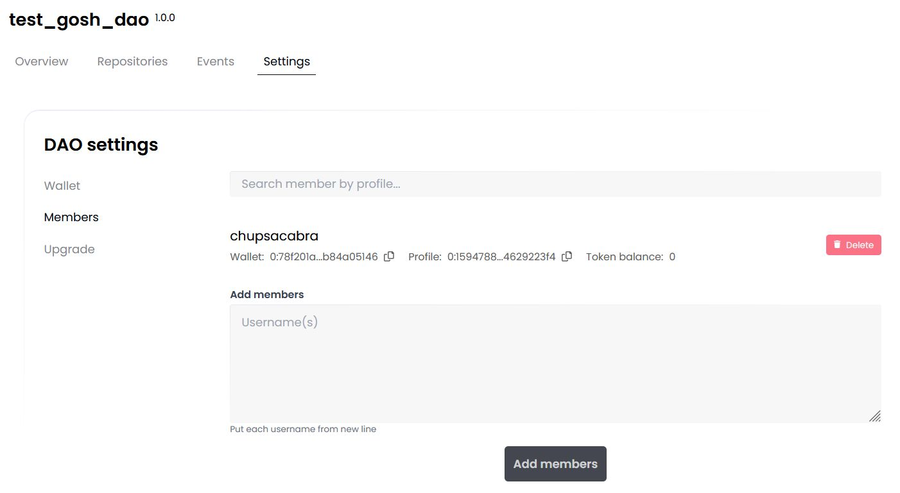
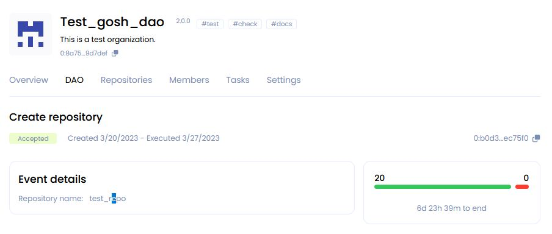

# __GOSH Web__

[GOSH Web](https://app.gosh.sh/) is also a good way to get started with GOSH.

It implements GOSH repository management as a simple web interface.

You will be able to create your GOSH account and Decentralized Autonomous Organization (DAO), set up and manage repositories. Repositories stored in GOSH can then be interacted with like any regular remote repository, with a few small configurations to git, making decentralized code management easily available to anyone.

<!-- 
tabs:

Overview
DAO
Repositories
Members
Tasks
Settings -->

<!-- 
Overview
* DAO system repository
* Recent proposals
* Repositories
    * create repo
    * ...
-----
* DAO total supply
* DAO reserve
* Your wallet balance
* Allowance
* Members1 + Invite members

DAO
* DAO events

Repositories
* DAO system repository ?
* create repo

Members
* Invite user to DAO

Tasks
* create task

Settings
* DAO Set up
    * Token setup
    * Proposal setup
    * Members setup
    * Save changes

* Upgrade
    * Upgrade DAO -->

## __Working with account__

### __Create account__

To get started with GOSH, you need an active Github-account.

Click **Create account with Github** to start registering on GOSH

After click **Authorize gosh-sh** 

!!! info
    The special GOSH DAO Bot will help with registration in Gosh.
    It will deploy your DAO and upload your selected repositories to GOSH.

In the list of organizations received from Github, click on the organization

and select repositories for upload into Gosh.

Do this **for each** organization for which you want to upload repositories to Gosh.

!!! danger
    After registering on GOSH you will not be able to return to this step in this release.

    This will be available later

!!! info
    If you want other GOSH users to be able to find you by your email, give permission.

Then click **Upload**

​If you are familiar with blockchain, you know what to do with a seed phrase.

If you're new to blockchain, all you need to know, is that this is the key to your account and all your assets on GOSH. Your public key, which can identify you on the blockchain and the secret key you'll use to sign your actions can always be calculated from your seed phrase.

To create the GOSH-account, the seed phrase will be generated for you. If you already have the GOSH-account, click **Clear** and enter your own one seed phrase.

!!! danger
    Write your seed phrase down and store it somewhere safe, and never share it with anyone. Avoid storing it in plain text or screenshots, or any other non-secure way. If you lose it, you lose access to your assets. Anyone who gets it, gets full access to your assets.

!!! info
    Your seed phrase will be used to log into GOSH.

Once you have written down your seed phrase, click **Continue.**

Then choose a short nickname or create a new one and click **Create account**.

!!! warning
    The Usernames must contain only Latin letters, numbers, hyphen, underscore character `( a...z, 0...9, -, _ )`

When entering the GOSH will ask you to set up a PIN code:

!!! info
    Set a new PIN code for each new session.

And unlock with PIN code.

The Organizations page will open after your account is created.

!!! info
    __When the repositories are uploaded, a notification will be sent to your email.__

Follow the link in the letter.

Enter the saved seed phrase and click **Sign in**.

Also set up a PIN code and unlock with PIN code.

### __View Public Key__

A user needs to know their public key, for example, when joining an organization.

To view your public key go to the main page of your account and click [**Settings**](https://app.gosh.sh/a/settings).

!!! danger
    Avoid storing your private key and seed phrase in plain text or screenshots, or any other non-secure way. If you lose it, you lose access to your assets. Anyone who gets it, gets full access to your assets.

## __Working with DAO__

<!-- ​Once created, your organization will appear in the organization list. Click on it to continue.

 -->

<!-- The first mandatory member is the creator, identified by their username.

The second member is the GOSH DAO Bot. It will synchronize repositories with github on Gosh.

Any other members can be added at creation - just enter the username of each member in new line.

At any later time the list of members [can be expanded](gosh-web.md#add-members-to-organization) by voting. -->

### __Create Organization (DAO)__

<!-- The Organizations page will open after your account is created. -->

Click **Сreate new DAO** button in the Organizations section.

On the DAO settings page that opens, input:

* __Organization name__

    !!! warning
        The Organizations name must contain only Latin letters, numbers, hyphen, underscore character `( a...z, 0...9, -, _ )`

* __Organization picture__

    The icon will be generated automatically.

* __Theme tags__

    You can add up to 3 tags separated by spaces. 
    According to them, GOSH users will be able to find your DAO.

* __Description__

    A short description that can be seen on the DAO page under the heading.

    The extended description can be added to the Readme file into _index system repository from the [Overview page](gosh-web.md#overview-of-the-dao) after creating the DAO.

* __Total supply__

    You also need to enter the number of tokens that will be issued for this DAO.

    The maximum value of the total supply can be the number 2^128.

* __Allow mint__

    This is a permission to emission DAO tokens.
    It is enabled by default.

    In the future, it will be possible to disable the emission of DAO tokens through proposal and voting in the [**Settings**](gosh-web.md#dao-set-up) section.

    !!! warning
        If you uncheck this option, the number of tokens issued for this DAO will be capped to the number entered during the initial setup

Click **Create organization**.

The DAO page will open after its creation.

### __Overview of the DAO__

All information about your DAO and its activities will be displayed here.

Information about DAO assets is displayed on the right.

* **DAO total supply** - the total issue of tokens of this DAO.

* **DAO reserve** - unallocated tokens.

    Push on the **SEND** button, you will create an proposal to transfer tokens from the DAO reserve to the DAO member.
    <!-- TODO -->

    Push on the **Mint** button, you will create an proposal to issue additional tokens for this DAO.
    <!-- TODO -->

* **Your wallet balance** - the amount of tokens you have in this DAO.

    !!! info
        When creating a DAO, 20 tokens from the DAO reserve will be issued to your wallet.

    Push on the **SEND** button, you will to transfer your tokens to the DAO reserve or to the GOSH user.
<!-- TODO -->

* **Karma** - the amount of tokens (upper limit) within which a DAO member can vote. 

    It is assigned when accepted as a member of the DAO. This determines the reputation of the DAO member. The Karma can be changed only by voting.

* **Members** - total number of DAO members.

    From here you can also send an invitation to become a member of the DAO.
    <!-- TODO -->

* **Recent proposals**

Information and status of the recent proposals will be displayed  in this section. 
Click on the name of the proposal you can go to the event page and [vote](gosh-web.md#voting-in-smv-soft-majority-vote).

* In the **Repositories** section, you can quickly find or [create a repository](gosh-web.md#create-repository).

* **DAO system repository**

The **_index** is a DAO system repository that is created automatically.

!!! info
    After creating the DAO, it will already contain 
    a text file with a brief description of your DAO,
    which you added in the settings earlier.

To add a README for your DAO, go to the _index repository and [create a file](ggosh-web/#create-file) in the main branch.

<!-- TODO 
    add organization description by placing
    readme.md file to main branch of _index repository -->

### __DAO Set up__

You can continue with the initial setup the DAO in the Settings tab.

<!-- TODO it might be worth removing this screen -->

In the **Token Setup** section, you can create a proposal to ban the issue of tokens from this DAO by unchecking the box.

!!! warning
    After the ban on the issue of DAO tokens, it will be impossible to allow the issue.

In the **Proposal setup** section you can enable/disable the option to view the voting results before it ends.

And also allow or prohibit discussion when working with proposals.

In the **Members setup** section you can grant or deny external users the ability to request membership in this DAO.

Then add a comment on changing the settings for other members of the DAO and click **Save changes and start proposal**.

!!! info
    __All settings and actions in the DAO will be performed the [voting](gosh-web.md#voting-in-smv-soft-majority-vote) procedure.__

### __Proposals and voting in SMV (Soft Majority Vote)__

Actions that require a DAO vote are performed by creating a proposal.

* [**create a pull request**](gosh-web.md#create-pull-request)
* **Add branch protection**
* **Remove branch protection**
* [**Add DAO member**](gosh-web.md#add-members-to-organization)
* **Remove DAO member**
* **Upgrade DAO**
* **Delete task**
* **Create task**
* [**Create repository**](gosh-web.md#create-repository)
* **Add voting tokens**
* **Add regular tokens**
* **Mint DAO tokens**
* **Add DAO tag**
* **Remove DAO tag**
* **Disable minting DAO tokens**
* **Change DAO member Karma**
* **Multi proposal**
* **Add repository tag**
* **Remove repository tag**
* **Update repository description**
* **Allow event discussions**
* **Show event progress**
* **Upgrade repository tags**
* **Ask DAO membership Karma**

<!-- 
TODO 
kinds of proposals:
1: 'Pull request',  // SETCOMMIT_PROPOSAL_KIND = 1
2: 'Add branch protection',   //ADD_PROTECTED_BRANCH_PROPOSAL_KIND = 2
3: 'Remove branch protection',   //DELETE_PROTECTED_BRANCH_PROPOSAL_KIND = 3
                                 //SET_TOMBSTONE_PROPOSAL_KIND = 4
5: 'Add DAO member',    //DEPLOY_WALLET_DAO_PROPOSAL_KIND = 5
6: 'Remove DAO member',   //DELETE_WALLET_DAO_PROPOSAL_KIND = 6
7: 'Upgrade DAO',     //SET_UPGRADE_PROPOSAL_KIND = 7
//8: 'Change DAO config',
//9: 'Confirm task',
10: 'Delete task',    //TASK_DESTROY_PROPOSAL_KIND = 10
11: 'Create task',    //TASK_DEPLOY_PROPOSAL_KIND = 11
12: 'Create repository',  //DEPLOY_REPO_PROPOSAL_KIND = 12
13: 'Add voting tokens',  //ADD_VOTE_TOKEN_PROPOSAL_KIND = 13
14: 'Add regular tokens', //ADD_REGULAR_TOKEN_PROPOSAL_KIND = 14
15: 'Mint DAO tokens',   //MINT_TOKEN_PROPOSAL_KIND = 15
16: 'Add DAO tag',     //DAOTAG_PROPOSAL_KIND = 16
17: 'Remove DAO tag',  //DAOTAG_DESTROY_PROPOSAL_KIND = 17
18: 'Disable minting DAO tokens',  //ALLOW_MINT_PROPOSAL_KIND = 18
19: 'Change DAO member allowance', //CHANGE_ALLOWANCE_PROPOSAL_KIND = 19
20: 'Multi proposal',  //MULTI_PROPOSAL_KIND = 20
21: 'Add repository tag',  //REPOTAG_PROPOSAL_KIND = 21
22: 'Remove repository tag', //REPOTAG_DESTROY_PROPOSAL_KIND = 22
23: 'Update repository description', //CHANGE_DESCRIPTION_PROPOSAL_KIND = 23
24: 'Allow event discussions',  // CHANGE_ALLOW_DISCUSSION_PROPOSAL_KIND = 24
25: 'Show event progress',  //CHANGE_HIDE_VOTING_PROPOSAL_KIND = 25
26: 'Upgrade repository tags', //TAG_UPGRADE_PROPOSAL_KIND = 26
27: 'Ask DAO membership allowance',  //ABILITY_INVITE_PROPOSAL_KIND = 27
-->

To create a proposal, or to vote for a proposal someone else created, some of your tokens need to be allocated to SMV (once the proposal is completed), you can get them back.

!!! info
    You can vote for a proposal only once.

For example, to merge into main, [create a pull request](gosh-web.md#create-pull-request) from some other branch. A proposal will be generated and will appear on the **Events** page.

<!-- TODO 
change images -->

<!--  -->

Open the proposal and review the contents.

<!--  -->

The voting period is indicated on the proposal page. This is the time allotted for [voting](../on-chain-architecture/organizations-gosh-dao-and-smv.md#soft-majority-voting). Unless a decisive majority of >50% is achieved early, votes will be counted at the end of this period.

Voting statistics are located under the status **Running**. The green and red counters indicate how many tokens have been used at the moment to vote for and against the proposal.

The green indicator in the top right corner means that the SMV smart contracts are not currently processing any new votes. It turns red when the SMV contracts are busy.

Once you have made a decision, select the amount of tokens with which you are ready to vote and click **Vote for proposal**

The red and green numbers next to **Running** status indicate how many tokens were used by now to vote for and against the proposal.

The green indicator in the top right corner means that the SMV smart contracts are not currently processing any new votes. It turns red when the SMV contracts are busy.

Once you have made a decision, input the amount of tokens, select **Approve** or **Reject** and click **Vote for proposal**. Vote registration can take a bit of time.

!!! info
    As per the rules of Soft Majority Voting, to have a proposal approved early, you need at least 50% of the total supply of tokens in the repository + 1 token used to vote for the proposal.

    For example, in a repository with two members, where the total supply of tokens is 200, 101 token needs to be used to instantly approve a proposal. Thus with every member holding 100 tokens a proposal can never be instantly completed without the participation of members other than the proposal's author.

    On the other hand, so as not to depend on all members of an organization to vote, soft majority vote will complete with an approval at the end of the voting period, if 10% of the total token supply were used to vote for, and no one voted against.

    The more tokens are sent against the proposal, the higher the approving amount needs to be (up to 50% of the total supply  + 1 token) for the proposal to pass.

Other members of the Organization, who have transferred their tokens to SMV, will be able to vote for the proposal on this page in their own accounts.

!!! info
    Currently, even in organizations with a single member, voting still takes place when a proposal is created. 51 tokens are needed to approve a proposal in such a repository.

Once a majority has been reached early, or the voting period ended and the soft majority vote result was decided, the proposal completes and the proposed action is performed.

### __Add Members to DAO__

<!-- TODO
change -->

Go to the ** Members ** tab to invite users to join the DAO.

To add member enter the username of each candidate from a new line and click **Add members** button.

<!--  -->

### __What's next?__

<!-- TODO
change -->

Set up [Git Remote Helper](git-remote-helper.md) and continue working with your repository.

You'll need your wallet credentials. Go to the main page of your account and click [**Settings**](https://app.gosh.sh/a/settings).
Scroll down and copy them.

To view the command to clone your repo, click the **Clone** button on your repo page.

## __Working with Repository__

### __Create Repository__

To create a repository in your DAO click **Create new** in the Repositories section or Overview section.​

Enter repository name and its description and click **Create repository**.

!!! warning
    The repository name must contain only Latin letters, numbers,hyphen, underscore character`( a...z, 0...9, -, _ )`

A page with **DAO** events will open for you.

Open the event click on its name.

The page that opens displays the name of the proposal, its status, and the time of creation and as well as the end of voting.

The scale shows the number of votes for the proposal and against.

Specify the number of tokens less than or equal to your Karma for voting and accept or reject this proposal.

Add your opinion about the proposal to the discussion below and click **Send vote**

<!-- TODO
remove this images -->
When the voting is over, its status will change to Accepted.

The created repository will appear in the list on the Repositories tab.

### __​Create Branch__

Repository is created with default main branch. To create another branch, click on the **branches** counter.​

Select the branch to be forked, enter new branch name, and click​ **Create branch**.

!!! warning
    The branch name must contain only Latin letters, numbers, hyphen, underscore character `( a...z, 0...9, -, _ )`

Once the branch is created, it will appear in the branches list.

Switch to it via drop down list.

### __Create File__

To create file, click **Add file** button.

Enter file contents and name.

You can use **Preview** if needed. MD syntax is supported for preview.

Once done, scroll down to **Commit data**, enter commit info and click **Commit changes**.​

Commit status will be displayed below.

If the branch you are working in requires no voting to confirm commits, the file will be added. Otherwise a DAO [vote](gosh-web.md#voting-in-smv-soft-majority-vote) will be initiated.

### __Create Pull Request__

 <!--  -->
Click on the **Pull requests** tab and set up the pull request: what branch to merge from and to. Once selected, click **Compare**.

The branches will be compared. Review the changes, set up the pull request and click Commit changes.

!!! info
    **Note**: When merging into the main branch, and in some other cases (depending on DAO setup), a DAO proposal will be initiated by trying to commit.

    Organization Tokens have to be sent to the DAO Soft Majority Vote contract to start a proposal for DAO members to [vote](gosh-web.md#voting-in-smv-soft-majority-vote) on.

<!-- ## __Working with Task__ -->
<!-- TODO 
add  -->

