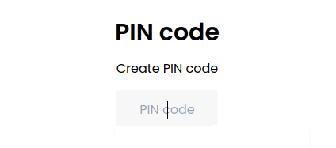
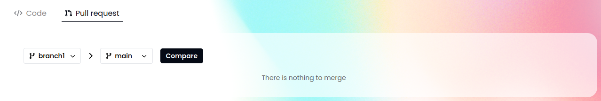
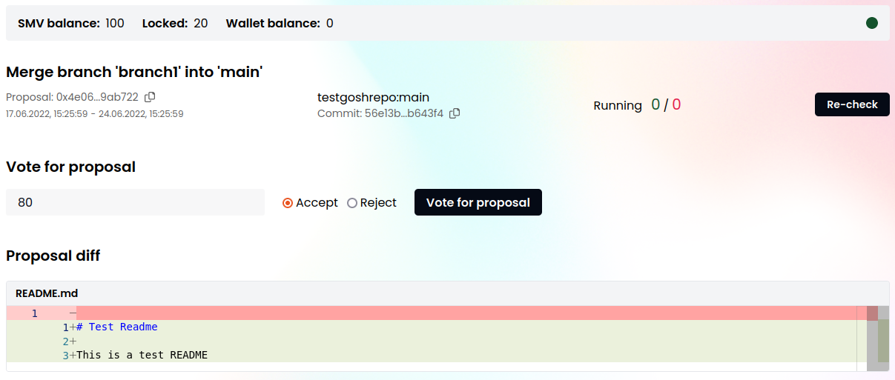
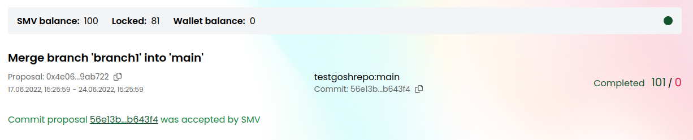

# GOSH Web

[GOSH Web](https://app.gosh.sh/) is also a good way to get started with GOSH.&#x20;

It implements GOSH repository management as a simple web interface.

You will be able to create your GOSH account and Decentralized Autonomous Organization (DAO), set up and manage repositories. Repositories stored in GOSH can then be interacted with like any regular remote repository, with a few small configurations to git, making decentralized code management easily available to anyone.

## Create account

To get started with GOSH, you need an active Github-account

Click **Create account with Github** to start registering on GOSH

<figure><figcaption></figcaption></figure>

After click **Authorize gosh-sh**&#x20;

<figure><figcaption></figcaption></figure>

In the list of organizations received from Github, click on the organization

<figure><figcaption></figcaption></figure>

and select repositories for upload into Gosh

<figure><figcaption></figcaption></figure>

Do this **for each** organization for which you want to upload repositories to Gosh.&#x20;

!!! danger
    After registering on GOSH you will not be able to return to this step in this release.

    This will be available later

Then return to the list of organizations and click **Upload**

<figure><figcaption></figcaption></figure>

​If you are familiar with blockchain, you know what to do with a seed phrase.

If you're new to blockchain, all you need to know, is that this is the key to your account and all your assets on GOSH. Your public key, which can identify you on the blockchain and the secret key you'll use to sign your actions can always be calculated from your seed phrase.

To create a Gosh-account, insert your seed phrase or сlick **Generate phrase**

<figure><figcaption></figcaption></figure>

!!! warning
    Write your seed phrase down and store it somewhere safe, and never share it with anyone. Avoid storing it in plain text or screenshots, or any other non-secure way. If you lose it, you lose access to your assets. Anyone who gets it, gets full access to your assets.

**Your seed phrase will be used to log into GOSH.**\
****\
****Once you have written down your seed phrase, click **Continue.**

****

Then choose a short nickname or create a new one and click **Create account**.

!!! warning
    The Usernames must contain only Latin letters, numbers, hyphen, underscore character `( a...z, 0...9, -, _ )`

<figure><figcaption></figcaption></figure>

!!! info
    When the repositories are uploaded, a notification will be sent to your email.

<figure><figcaption></figcaption></figure>

To log into Gosh, click **Sign in.**

<figure><figcaption></figcaption></figure>

Enter the saved seed phrase and click **Sign in.**

<figure><figcaption></figcaption></figure>

GOSH will ask you to set up a PIN code:

Once done, you will be logged into GOSH.

## Create Organization

The Organizations page will open after your account is created. At first there will be no Organizations or Repositories there.

Click **New organization** button in the Organizations section.

<figure><figcaption></figcaption></figure>

​Input Organization name and members.&#x20;

!!! warning
    The Organizations name must contain only Latin letters, numbers, hyphen, underscore character `( a...z, 0...9, -, _ )`

The first mandatory member is the creator, identified by their username.&#x20;

Any other members can be added at creation - just enter the username of each member with the `@` symbol. At any later time the list of members [can be expanded](gosh-web.md#whats-next).

<figure><figcaption></figcaption></figure>

Click **Create organization**.

​Once created, your organization will appear in the organization list. Click on it to continue.\

<figure><figcaption></figcaption></figure>

## Create Repository

To create a repository in your organization click **New repository** in the Repositories section.​

<figure><figcaption></figcaption></figure>

Enter repository name and click **Create repository**.

!!! warning
    The repository name must contain only Latin letters, numbers, hyphen, underscore character `( a...z, 0...9, -, _ )`

<figure><figcaption></figcaption></figure>

## ​Create Branch

Repository is created with default main branch. To create another branch, click on the **branches** counter.​

<figure><figcaption></figcaption></figure>

Select the branch to be forked, enter new branch name, and click​ **Create branch**.

!!! warning
    The branch name must contain only Latin letters, numbers, hyphen, underscore character `( a...z, 0...9, -, _ )`

<figure><figcaption></figcaption></figure>

Once the branch is created, it will appear in the branches list.

<figure><figcaption></figcaption></figure>

Switch to it via drop down list.

<figure><figcaption></figcaption></figure>

## Create File

To create file, click **Add file** button.

<figure><figcaption></figcaption></figure>

Enter file contents and name.

<figure><figcaption></figcaption></figure>

You can use preview if needed. MD syntax is supported for preview.

Once done, scroll down to **Commit data**, enter commit info and click **Commit changes**.​

<figure><figcaption></figcaption></figure>

Commit status will be displayed below.

<figure><figcaption></figcaption></figure>

If the branch you are working in requires no voting to confirm commits, the file will be added. Otherwise a DAO [vote](gosh-web.md#voting-in-smv-soft-majority-vote) will be initiated.

## Create Pull Request 

Click on the **Pull requests** tab and set up the pull request: what branch to merge from and to. Once selected, click **Compare**.

The branches will be compared. Review the changes, set up the pull request and click Commit changes.

<figure><figcaption></figcaption></figure>

!!! info
    **Note**: When merging into the main branch, and in some other cases (depending on DAO setup), a DAO proposal will be initiated by trying to commit.

    [Organization Tokens have to be sent to the DAO Soft Majority Vote](gosh-web.md#move-tokens-to-smv) contract to start a proposal for DAO members to [vote](gosh-web.md#voting-in-smv-soft-majority-vote) on.

## Voting in SMV (Soft Majority Vote)

Actions that require a DAO vote, such as merging into main, are performed by creating a proposal.

To create a proposal, or to vote for a proposal someone else created, some of your tokens need to be [allocated to SMV](gosh-web.md#send-tokens-to-smv) (once the proposal is completed), you can get them back.

For example, to merge into main, [create a pull request](gosh-web.md#create-pull-request) from some other branch. A proposal will be generated and will appear on the **Events** page.

Open the proposal and review the contents.

The voting period is indicated on the proposal page. This is the time allotted for [voting](../on-chain-architecture/organizations-gosh-dao-and-smv.md#soft-majority-voting). Unless a decisive majority of >50% is achieved early, votes will be counted at the end of this period.

The red and green numbers next to **Running** status indicate how many tokens were used by now to vote for and against the proposal.

The green indicator in the top right corner means that the SMV smart contracts are not currently processing any new votes. It turns red when the SMV contracts are busy.

Once you have made a decision, select **Approve** or **Reject** and click **Vote for proposal**. Vote registration can take a bit of time.&#x20;

!!! info
    As per the rules of Soft Majority Voting, to have a proposal approved early, you need at least 50% of the total supply of tokens in the repository + 1 token used to vote for the proposal.

    For example, in a repository with two members, where the total supply of tokens is 200, 101 token needs to be used to instantly approve a proposal. Thus with every member holding 100 tokens a proposal can never be instantly completed without the participation of members other than the proposal's author.

    On the other hand, so as not to depend on all members of an organization to vote, soft majority vote will complete with an approval at the end of the voting period, if 10% of the total token supply were used to vote for, and no one voted against.

    The more tokens are sent against the proposal, the higher the approving amount needs to be (up to 50% of the total supply  + 1 token) for the proposal to pass.

Other members of the Organization, who have transferred their tokens to SMV, will be able to vote for the proposal on this page in their own accounts.

!!! info
    Currently, even in organizations with a single member, voting still takes place when a proposal is created. 51 tokens are needed to approve a proposal in such a repository.

Once a majority has been reached early, or the voting period ended and the soft majority vote result was decided, the proposal completes and the proposed action is performed.

## View Public Key

A user needs to know their public key, for example, when joining an organization.

To view your public key go to the main page of your account and click **Settings**.

!!! warning
    Avoid storing your private key and seed phrase in plain text or screenshots, or any other non-secure way. If you lose it, you lose access to your assets. Anyone who gets it, gets full access to your assets.

<figure><figcaption></figcaption></figure>

## Add Members to Organization 

Go to Organization **Settings** to the **Members** tab to manage your organization.

<figure><figcaption></figcaption></figure>

To add members, enter their [public key](gosh-web.md#view-public-key)s in the field, each from a new line, and click  **Add members** button.

## What's next? 

Set up [Git Remote Helper](git-remote-helper.md) and continue working with your repository.

You'll need your wallet credentials. Go to **Organization Settings**  - **Wallet** and copy your Git Remote credentials.

<figure><figcaption></figcaption></figure>
