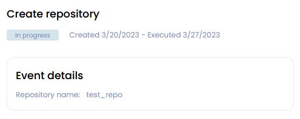

# __GOSH Web__

[GOSH Web](https://app.gosh.sh/) is also a good way to get started with GOSH.

It implements GOSH repository management as a simple web interface.

You will be able to create your GOSH account and Decentralized Autonomous Organization (DAO), set up and manage repositories. Repositories stored in GOSH can then be interacted with like any regular remote repository, with a few small configurations to git, making decentralized code management easily available to anyone.

<!-- 
tabs:

Overview -- 
DAO         
Repositories 
Members   
Tasks
Settings 
-->

<!-- 
Overview
* DAO system repository
* Recent proposals
* Repositories
    * create repo
    * ...
-----
* DAO total supply ---
* DAO reserve----
* Your wallet balance----
* Allowance---
* Members1 + Invite members---

DAO
* DAO events---

Repositories
* DAO system repository ?
* create repo---

Members
* Invite user to DAO---

Tasks
* create task

Settings
* DAO Set up
    * Token setup----
    * Proposal setup---
    * Members setup---
    * Save changes---

* Upgrade
    * Upgrade DAO 
-->

## __Working with account__

### __Create account__

To get started with GOSH, you need an active Github-account.

Click **Create account with Github** to start registering on GOSH

After click **Authorize gosh-sh** 

!!! info
    The special GOSH DAO Bot will help with registration in Gosh.
    It will deploy your DAO and upload your selected repositories to GOSH.

In the list of organizations received from Github, click on the organization

and select repositories for upload into Gosh.

Do this **for each** organization for which you want to upload repositories to Gosh.

!!! danger
    After registering on GOSH you will not be able to return to this step in this release.

    This will be available later

!!! info
    If you want other GOSH users to be able to find you by your email, give permission.

Then click **Upload**

​If you are familiar with blockchain, you know what to do with a seed phrase.

If you're new to blockchain, all you need to know, is that this is the key to your account and all your assets on GOSH. Your public key, which can identify you on the blockchain and the secret key you'll use to sign your actions can always be calculated from your seed phrase.

To create the GOSH-account, the seed phrase will be generated for you. If you already have the GOSH-account, click **Clear** and enter your own one seed phrase.

!!! info
    Your seed phrase will be used to log into GOSH.

!!! danger
    **Write your seed phrase down and store it somewhere safe, and never share it with anyone. Avoid storing it in plain text or screenshots, or any other non-secure way. If you lose it, you lose access to your assets. Anyone who gets it, gets full access to your assets.**

Once you have written down your seed phrase, click **Continue.**

Then choose your username in GOSH. **This is your unique cryptographic identifier in Gosh.
**

!!! Danger
    **Please note that after creating your username it will be impossible to change it in the future.**

if your username is already taken, please choose another one.

!!! warning
    The username must contain only Latin letters, numbers, hyphen, underscore character `( a...z, 0...9, -, _ )`

And click **Create account**.

When entering the GOSH will ask you to set up a PIN code:

!!! info
    Set a new PIN code for each new session.

And unlock with PIN code.

!!! warning
    If the name of the organization or repository already exists, you will receive the message.
    Change the name, click **save changes** and confirm the action with a pin code.

The Organizations page will open after your account is created.

!!! info
    __When the repositories are uploaded, a notification will be sent to your email.__

Follow the link in the letter.

Enter the saved seed phrase and click **Sign in**.

Also set up a PIN code and unlock with PIN code.

### __View Public Key__

A user needs to know their public key, for example, when joining an organization.

To view your public key go to the main page of your account and click [**Settings**](https://app.gosh.sh/a/settings).

!!! danger
    Avoid storing your private key and seed phrase in plain text or screenshots, or any other non-secure way. If you lose it, you lose access to your assets. Anyone who gets it, gets full access to your assets.

## __Working with DAO__

​Once created, your organization will appear in the organization list. Click on it to continue.

The first mandatory member is the GOSH DAO Bot. It will synchronize repositories with github on Gosh.

The second member is the creator, identified by their username.

At any later time the list of members [can be expanded](gosh-web.md#add-members-to-dao) by voting.

### __Create Organization (DAO)__

<!-- The Organizations page will open after your account is created. -->

Click **Сreate new DAO** button in the Organizations section.

On the DAO settings page that opens, input:

* __Organization name__

    !!! warning
        The Organizations name must contain only Latin letters, numbers, hyphen, underscore character `( a...z, 0...9, -, _ )`

* __Organization picture__

    The icon will be generated automatically.

* __Theme tags__

    You can add up to 3 tags separated by spaces. 
    According to them, GOSH users will be able to find your DAO.

* __Description__

    A short description that can be seen on the DAO page under the heading.

    The extended description can be added to the Readme file into _index system repository from the [Overview page](gosh-web.md#overview-of-the-dao) after creating the DAO.

* __Total supply__

    You also need to enter the number of tokens that will be issued for this DAO.

    The maximum value of the total supply can be the number 2^128.

* __Allow mint__

    This is a permission to emission DAO tokens.
    It is enabled by default.

    In the future, it will be possible to disable the emission of DAO tokens through proposal and voting in the [**Settings**](gosh-web.md#dao-set-up) section.

    !!! warning
        If you uncheck this option, the number of tokens issued for this DAO will be capped to the number entered during the initial setup

Click **Create organization**.

The DAO page will open after its creation.

### __Overview of the DAO__

All information about your DAO and its activities will be displayed here.

Information about DAO assets is displayed on the right.

* **DAO total supply** - the total issue of tokens of this DAO.

* **DAO reserve** - unallocated tokens.

    Push on the **SEND** button, you will create an proposal to transfer tokens from the DAO reserve to the DAO member.
    <!-- TODO -->

    Push on the **Mint** button, you will create an proposal to issue additional tokens for this DAO.
    <!-- TODO -->

* **Your wallet balance** - the amount of tokens you have in this DAO.

    !!! info
        When creating a DAO, 20 tokens from the DAO reserve will be issued to your wallet.

    Push on the **SEND** button, you will to transfer your tokens to the DAO reserve or to the GOSH user.
<!-- TODO -->

* **Karma** - the amount of tokens (upper limit) within which a DAO member can vote. 

    It is assigned when accepted as a member of the DAO. This determines the reputation of the DAO member. The Karma can be changed only by voting.

* **Members** - total number of DAO members.

    From here you can also send an invitation to become a member of the DAO.
    <!-- TODO -->

* **Recent proposals**

Information and status of the recent proposals will be displayed  in this section. 
Click on the name of the proposal you can go to the event page and [vote](gosh-web.md#voting-in-smv-soft-majority-vote).

* In the **Repositories** section, you can quickly find or [create a repository](gosh-web.md#create-repository).

* **DAO system repository**

The **_index** is a DAO system repository that is created automatically.

!!! info
    After creating the DAO, it will already contain 
    a text file with a brief description of your DAO,
    which you added in the settings earlier.

To add a README for your DAO, go to the _index repository or follow the link in this section.

<!-- and [create a file](gosh-web.md#create-file) in the main branch. -->
<!-- TODO
replace to create file -->

Make sure you are in the **main** branch and click **Add file** button.

Enter file contents and name.

You can use **Preview** if needed. MD syntax is supported for preview.

After scroll down and enter commit info:

* Commit description - you can add a description of your commit;

* Commit tags - this is a mutable pointer of the commit. You can add the tag to quickly go to this commit and see what has been done;

<!--  -->

* Select a task - if you want to attach your commit to the solution of the Task, then select the desired task from the list;

* and add Assigners, Reviewers and Managers if necessary.

If a Task has been selected, check the **Create proposal** box.

And click **Commit changes**

<!--  -->

After that a proposal to the pull request will be created.

When the proposal to the pull request is accepted, the description of the DAO will appear on the **Overview** tab.

### __DAO Set up__

You can continue with the initial setup the DAO in the Settings tab.

<!-- TODO it might be worth removing this screen -->

In the **Token Setup** section, you can create a proposal to ban the issue of tokens from this DAO by unchecking the box.

!!! warning
    After the ban on the issue of DAO tokens, it will be impossible to allow the issue.

In the **Proposal setup** section you can enable/disable the option to view the voting results before it ends.

And also allow or prohibit discussion when working with proposals.

In the **Members setup** section you can grant or deny external users the ability to request membership in this DAO.

Then add a comment on changing the settings for other members of the DAO and click **Save changes and start proposal**.

!!! info
    __All settings and actions in the DAO will be performed the [voting](gosh-web.md#voting-in-smv-soft-majority-vote) procedure.__

### __Upgrade__

When a new version of contracts is released in GOSH, the user needs to upgrade their contracts.

The upgrade is initiated by the [proposal](gosh-web.md#proposals-and-voting-in-smv-soft-majority-vote).

!!! info
    Complete all proposle before starting the upgrade. All uncompleted proposals will be rejected and will not be transferred to the upgraded version.

You can see a message about the availability of a new version 
and an invitation to update in the DAO.

Depending on which version you currently have, choose the appropriate update method.

* __From version 1 to version 2__

You can go to the **Upgrade** section from the new version message or go to the **Settings** tab.

Select the version you want to upgrade and click **Create proposal for DAO upgrade**:

You will be taken to the DAO page with events.

After the completion of [voting for the proposal](gosh-web.md#proposals-and-voting-in-smv-soft-majority-vote), the procedure for updating your DAO will begin.

Then you need to update all the Repositories.

To do this, go to their tab and click **Get repositories**

and then click **Start repositories upgrade** to create a proposal

On the DAO tab, vote for the proposal to create a repository

* __From version 2 to version 3__

Tasks were added in contracts version 2.

Uninitialized Tasks will not be migrated to the new version.

!!! warning
    Before starting the update make sure that there are commits in the Tasks.

Go to the Settings tab or follow the link in the upgrade message.

Select the version you want to update.

* __From version 1 to version 3__

* __From version 3 to version 4__

<!-- short description of DAO located in the _index repository

You can leave a comment on the proposal.

To transfer a brief description of the DAO from the _index repository

and

check mark on the permission for additional token issuance - individual proposal -->

### __Proposals and voting in SMV (Soft Majority Vote)__

Actions that require a DAO vote are performed by creating a proposal.

!!! warning
    To create an proposal, you must have at least 20 tokens on your wallet balance.

* [**Create a pull request**](gosh-web.md#create-pull-request)
* **Add branch protection**
* **Remove branch protection**
* [**Add DAO member**](gosh-web.md#add-members-to-dao)
* **Remove DAO member**
* [**Upgrade DAO**](gosh-web.md#upgrade)
* [**Delete task**](gosh-web.md#deleting-task)
* [**Create task**](gosh-web.md#create-task)
* [**Create repository**](gosh-web.md#create-repository)
* **Add voting tokens**
* **Add regular tokens**
* **Mint DAO tokens**
* **Add DAO tag**
* **Remove DAO tag**
* **Disable minting DAO tokens**
* [**Change DAO member Karma**](gosh-web.md#change-dao-member-karma)

<!-- !!! Warning
    Be careful when distributing karma among the members of the TAO.
    Avoid the possibility of a preponderance in the votes of one of the DAO members.
    To avoid a situation where one participant will be able to transfer the entire balance of the DAO to his wallet. -->

* **Multi proposal** - includes several offers at once. 

    For example: [adding members to the DAO by another DAO member](gosh-web.md#add-members-to-dao)

* **Add repository tag**
* **Remove repository tag**
* **Update repository description**
* **Allow event discussions**
* **Show event progress**
* **Upgrade repository tags**
* [**Ask DAO membership**](gosh-web.md#request-dao-membership)

<!-- 

status:
In progress
Accepted
Rejected

TODO 
kinds of proposals:
1: 'Pull request',  // SETCOMMIT_PROPOSAL_KIND = 1
2: 'Add branch protection',   //ADD_PROTECTED_BRANCH_PROPOSAL_KIND = 2
3: 'Remove branch protection',   //DELETE_PROTECTED_BRANCH_PROPOSAL_KIND = 3
                                 //SET_TOMBSTONE_PROPOSAL_KIND = 4
5: 'Add DAO member',    //DEPLOY_WALLET_DAO_PROPOSAL_KIND = 5
6: 'Remove DAO member',   //DELETE_WALLET_DAO_PROPOSAL_KIND = 6
7: 'Upgrade DAO',     //SET_UPGRADE_PROPOSAL_KIND = 7
//8: 'Change DAO config',
//9: 'Confirm task',
10: 'Delete task',    //TASK_DESTROY_PROPOSAL_KIND = 10
11: 'Create task',    //TASK_DEPLOY_PROPOSAL_KIND = 11
12: 'Create repository',  //DEPLOY_REPO_PROPOSAL_KIND = 12
13: 'Add voting tokens',  //ADD_VOTE_TOKEN_PROPOSAL_KIND = 13
14: 'Add regular tokens', //ADD_REGULAR_TOKEN_PROPOSAL_KIND = 14
15: 'Mint DAO tokens',   //MINT_TOKEN_PROPOSAL_KIND = 15
16: 'Add DAO tag',     //DAOTAG_PROPOSAL_KIND = 16
17: 'Remove DAO tag',  //DAOTAG_DESTROY_PROPOSAL_KIND = 17
18: 'Disable minting DAO tokens',  //ALLOW_MINT_PROPOSAL_KIND = 18
19: 'Change DAO member allowance', //CHANGE_ALLOWANCE_PROPOSAL_KIND = 19
20: 'Multi proposal',  //MULTI_PROPOSAL_KIND = 20
21: 'Add repository tag',  //REPOTAG_PROPOSAL_KIND = 21
22: 'Remove repository tag', //REPOTAG_DESTROY_PROPOSAL_KIND = 22
23: 'Update repository description', //CHANGE_DESCRIPTION_PROPOSAL_KIND = 23
24: 'Allow event discussions',  // CHANGE_ALLOW_DISCUSSION_PROPOSAL_KIND = 24
25: 'Show event progress',  //CHANGE_HIDE_VOTING_PROPOSAL_KIND = 25
26: 'Upgrade repository tags', //TAG_UPGRADE_PROPOSAL_KIND = 26
27: 'Ask DAO membership allowance',  //ABILITY_INVITE_PROPOSAL_KIND = 27
-->

To vote for the proposal, some of your tokens must be be allocated to SMV (once the proposal is completed), you can get them back.

!!! info
    You can vote for a proposal only once.

For example, to merge into main, [create a pull request](gosh-web.md#create-pull-request) from some other branch. A proposal will be generated and will appear on the **DAO** tab.

<!-- TODO 
change images -->

<!--  -->

Open the proposal and review the contents.

<!--  -->

The voting period is indicated on the proposal page. This is the time allotted for [voting](../on-chain-architecture/organizations-gosh-dao-and-smv.md#soft-majority-voting). 

Unless a decisive majority of >50% Global Karma Count is achieved early, votes will be counted at the end of this period.

!!! info 
    Global Karma Count is the total amount of Karma calculated by summing up the Karma of all DAO members at the time of the proposal creation.

<!-- 
TODO update

Voting statistics are located under the status **Running**. The green and red counters indicate how many tokens have been used at the moment to vote for and against the proposal.

The green indicator in the top right corner means that the SMV smart contracts are not currently processing any new votes. It turns red when the SMV contracts are busy.

Once you have made a decision, select the amount of tokens with which you are ready to vote and click **Vote for proposal**

The red and green numbers next to **Running** status indicate how many tokens were used by now to vote for and against the proposal.

The green indicator in the top right corner means that the SMV smart contracts are not currently processing any new votes. It turns red when the SMV contracts are busy. -->

Once you have made a decision, input the amount of tokens, select **Approve** or **Reject** and click **Vote for proposal**. Vote registration can take a bit of time.

!!! info
    As per the rules of Soft Majority Voting, to have a proposal approved early, you need at least 50% of the total supply of tokens in the repository + 1 token used to vote for the proposal.

    For example, in a repository with two members, where the total supply of tokens is 200, 101 token needs to be used to instantly approve a proposal. Thus with every member holding 100 tokens a proposal can never be instantly completed without the participation of members other than the proposal's author.

    On the other hand, so as not to depend on all members of an organization to vote, soft majority vote will complete with an approval at the end of the voting period, if 10% of the total token supply were used to vote for, and no one voted against.

    The more tokens are sent against the proposal, the higher the approving amount needs to be (up to 50% of the total supply  + 1 token) for the proposal to pass.

Other members of the Organization, who have transferred their tokens to SMV, will be able to vote for the proposal on this page in their own accounts.

!!! info
    Currently, even in organizations with a single member, voting still takes place when a proposal is created. 51 tokens are needed to approve a proposal in such a repository.

Once a majority has been reached early, or the voting period ended and the soft majority vote result was decided, the proposal completes and the proposed action is performed.
<!--  -->

## **Working with DAO Members**

### __Adding Members to DAO__

Membership in the DAO can be obtained in several ways.

The user can be invited to the DAO using a [special form](gosh-web.md#add-by-gosh-username-or-e-mail) or by an [invitation link](gosh-web.md#invite-by-link).

Also, the user can independently [create a membership request](gosh-web/#request-dao-membership) in the DAO.

!!! info
    Adding a member to the DAO is possible only through an proposal.

*Depending on the chosen path, tokens and Karma will be distributed immediately after acceptance proposal, or additional proposals will need to be created for this.*

#### <u>Adding by GOSH username or e-mail</u>

A DAO member can create a proposle to add GOSH user into the DAO.

To do this, go to the tab **Members** in the section **Invite user to DAO**.

* If you know the GOSH username, then enter it.

* If you don't know the name or the user doesn't have a GOSH account yet, enter their email address.

!!! info
    The email address will change to the GOSH username if the user has given permission during registration so that it can be found by email.

Offer the amount of karma for him and please comment your decision.

!!! info
    You can send an invitation proposal to several users at once.

And click **Send invite**.

!!! info
    At the same time, a multi proposal will be created to add DAO members and provide voting tokens.

Go to the DAO tab and select the desired event for voting.

<!-- TODO
insert a image before going to the events section -->

#### <u>Invite by link</u>

You can invite a user to the DAO by generating an invitation link for them.

!!! warning
    Enable "Allow external users to request DAO membership" option in [DAO settings](gosh-web.md#dao-set-up) to enable invites by email/link.

To do this, on the tab **Members** in the section **Invite user to DAO** click on **Get one-time invitation link**.

!!! info
    The link to the invitation can only be used one time.

All active invitation links will be displayed in the section on the right.

When the invited user creates a membership proposle in the DAO, the link entry disappears.

You can also deactivate the link click on the **Revoke**.

When the user clicks the link, they will be able to create an account or log into GOSH.

Then input a short nickname or and click **Create account and continue**.

Enter a short comment who are you and click **Accept invitation**.

On the event page that opens, you can find a request for your acceptance as a member of the DAO.

Click on it you can track the results of voting and discussions.

After the proposal is accepted, its status will change to **Accepted**

!!! info
    You will be able to request voting tokens after you are accepted into the DAO by creating your proposal.
<!-- TODO
add a cross-reference to the karma change propos -->

#### <u>Request DAO membership</u>

You can create a membership request in the DAO yourself. To do this, you need to know the link to this DAO. 

!!!info
    Only a registered user will be able to create a membership request.

Follow this link and you will see the overview page of the DAO you are interested in.

Click **Request membership**.

In the window that opens, write who you are and why you want to become a member of this DAO. This description will help the members of the DAO to make a decision when voting.

Then click **Create proposal**.

On the event page that opens, you can find a request for your acceptance as a member of the DAO.

After the DAO members vote, the status of your request will change to **Accepted** or **Rejected**

You can follow the voting and discussion by opening the event.

<!-- TODO
searching for users by DAO
 -->

### __Change DAO member Karma__

Any member of the DAO can send a request to change Karma.  
To do this, go to the **Members** tab and change the number of Karma and token balance of one or more DAO members, including for yourself.

!!! warning
    To create an proposal, you must have at least 20 tokens on your wallet balance.

!!! Warning
    Be careful when distributing karma among the members of the DAO.  
    Avoid the possibility of a preponderance in the votes of one of the DAO members.  
    To avoid a situation where one participant will be able to transfer the entire balance of the DAO to his wallet.

Then click **Save changes and create proposal**.  
As a result, a Multi proposal will be created and you will be redirected to the event page **Dao**.

Inside the event, you can get details of Multi proposal.

After accepting the multi proposal, the user will receive tokens and Karma from DAO reserve. This can be seen on the **Members** tab

### __Delete Members from the DAO__

To delete a member from the DAO, go to the **Members** tab and click on the cross to the desired member.

!!! warning
    To create an proposal, you must have at least 20 tokens on your wallet balance.

Confirm the deletion by clicking OK.

As a result, a Multi proposal will be created and you will be redirected to the event page **Dao**.

The details of the multi proposl can be seen by going to it.

After voting and accepting multi proposal, the user will be deleted from the list of members of the DAO. 

The Karma of the deleted user will be equal to 0.  
But the tokens, if they were, will stay on the balance of the user's wallet.

### __What's next?__

<!-- TODO
change -->

Set up [Git Remote Helper](git-remote-helper.md) and continue working with your repository.

You'll need your wallet credentials. Go to the main page of your account and click [**Settings**](https://app.gosh.sh/a/settings).
Scroll down and copy them.

To view the command to clone your repo, click the **Clone** button on your repo page.

## __Working with Repository__

### __Create Repository__

To create a repository in your DAO click **Create new** in the Repositories section or Overview section.​

Enter repository name and its description and click **Create repository**.

!!! warning
    The repository name must contain only Latin letters, numbers,hyphen, underscore character`( a...z, 0...9, -, _ )`

A page with **DAO** events will open for you.

Open the event click on its name.

The page that opens displays the name of the proposal, its status, and the time of creation and as well as the end of voting.

The scale shows the number of votes for the proposal and against.

Specify the number of tokens less than or equal to your Karma for voting and accept or reject this proposal.

Add your opinion about the proposal to the discussion below and click **Send vote**

The created repository will appear in the list on the Repositories tab.

### __​Create Branch__

Repository is created with default main branch. To create another branch, click on the **branches** counter.​

Select the branch to be forked, enter new branch name, and click​ **Create branch**.

!!! warning
    The branch name must contain only Latin letters, numbers, hyphen, underscore character `( a...z, 0...9, -, _ )`

Once the branch is created, it will appear in the branches list.

Switch to it via drop down list.

### __Create File__

To create file, click **Add file** button.

Enter file contents and name.

You can use **Preview** if needed. MD syntax is supported for preview.

After scroll down and enter commit info:

* Commit description - you can add a description of your commit;

* Commit tags - this is a mutable pointer of the commit. You can add the tag to quickly go to this commit and see what has been done;

* Select task - if the branch is not protected and your file is a solution to a problem, you can choose a particular task;

* and add Assigners, Reviewers and Managers if necessary.

 and click **Commit changes**

If the branch you are working in requires no voting to confirm commits, the file will be added. Otherwise a DAO [vote](gosh-web.md#voting-in-smv-soft-majority-vote) will be initiated.

Commit status will be displayed below.

### __Create Pull Request__

Click on the **Pull requests** tab and set up the pull request: what branch to merge from and to. Once selected, click **Compare**.

The branches will be compared. Review the changes, set up the pull request and click Commit changes.

!!! info
    **Note**: When merging into the main branch, and in some other cases (depending on DAO setup), a DAO proposal will be initiated by trying to commit.

    Organization Tokens have to be sent to the DAO Soft Majority Vote contract to start a proposal for DAO members to [vote](gosh-web.md#voting-in-smv-soft-majority-vote) on.

## __Working with Task__

### __Create Task__

To create a Task, go to the Tasks tab and click **Create Task**

Then you need to fill in the Task conditions.

The result of the Task should be a pull request to include changes in the repository.

Select the repository for which the Task is being created.

Add the Task name.

You can add 3 tags separated by spaces to quickly find the task.

Then you need to evaluate the Task.

**Task cost** is the number of tokens that will be paid from the DAO reserve for its execution.

!!! info
    The members of the DAO agree between themselves how to evaluate the Tasks.

After attaching a pull request to the Task, the tokens will be distributed between the author, reviewer and manager in the ratio you set.

**Author** - the person who executes the Task.  
**Reviewer** - the person who checks the correctness of the Task.  
**Manager** - the person who manages the Task execution process.

!!! info
    The number of authors, areviewers and managers is set at your choice.  
    <!-- If, when forming a Task, you assign rewards for the reviewer and the manager, and the Task was performed without them, then author will receive his part, and not the ones issued to return to the dao reserve.  
    All non-rewards will be returned to the DAO Reserve. -->

Select vesting and lock periods. 

**Lock (cliff)** - the period after which the reward payments will begin. 
The countdown will start after accepting the proposal about completing the Task.  
**Vesting** - rules for transferring the fixed part of the tokens to the disposal of the contractor.

For example, lock - 12 months, vesting - 2 months.  

!!! warning
    In order for the investment scheme to be correct, the smaller of the number of tokens allocated to the participants of the task must be a multiple of the number of months of investment.

Add a comment the token distribution rules and click **Create task and start proposal**

After creating the proposal, you will be taken to the DAO page with events.

Inside the proposal you will be able to see all the conditions of the Task.  
In the table you can see the period since which month and in what parts the payments will be made to the participants of the Task.

<!--  -->

After accepting the proposal, the Task will appear in the list on the **Tasks** tab with the status *Awaiting commits*.

When the Author has completed the Task, he adds it to the commit.

!!! info
    If you need to make several commits to complete a Task,, create a separate branch.  
    And do **Select task** when creating the proposal to the pull request.

After that a proposal to the pull request will be created.  

Detailed information can be viewed by going to it on the DAO tab with events.

If the reviewer was specified during the commit, the event will wait for verification from them.

Then, after the reviewer send the solution, it will be possible to vote for the proposal.  
When the pull request is accepted, the Task status will change to **Confirmed**.

After the lock period ends, the participants of the Task can receive a reward.
To do this, go to the **Tasks** tab in the completed Task and click **Claim reward**.

!!! note
    If Lock period (cliff) has been set to zero, then you can click **Claim reward** immediately after accepting the pull request.

Thus the tokens will begin to be transferred to the wallets of the participants of the completed Task in accordance with the vesting scheme when the lock period ends.

### __Deletе Task__

To delete a Task, go to it on the **Tasks** tab.
And click to **Delete task**

After creating a proposal about deleting a Task, you will be redirected to the event page **Dao**.

When the proposal is accepted, the Task will be deleted.  
The tokens allocated for this Task will be returned to the DAO reserve.

