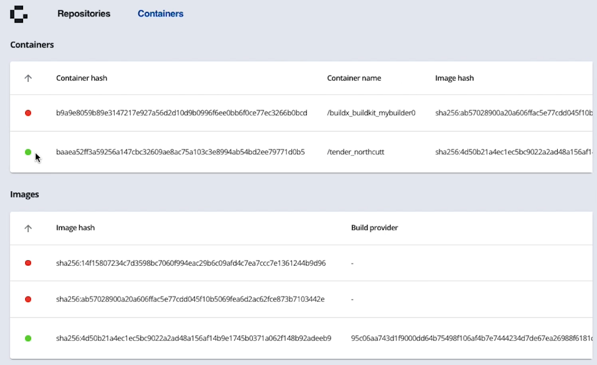
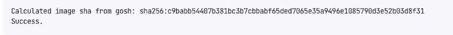

# Verify Images in Docker Extension

Once you have pulled a GOSH image someone else [built](build-and-sign-images.md) and uploaded to dockerhub, you can verify, that it was build from the exact code on GOSH that it claims to be built from.

To do that, go to **Containers** Tab in Docker Extension.

Your containers and their hashes are listed on this tab.

Scroll left to see the GOSH repository link it claims to be build from.

Click **Validate**.

GOSH docker extension will read the hash of the container, rebuild the container from the specified repository, compare resulting hash and report whether the hashes match.

